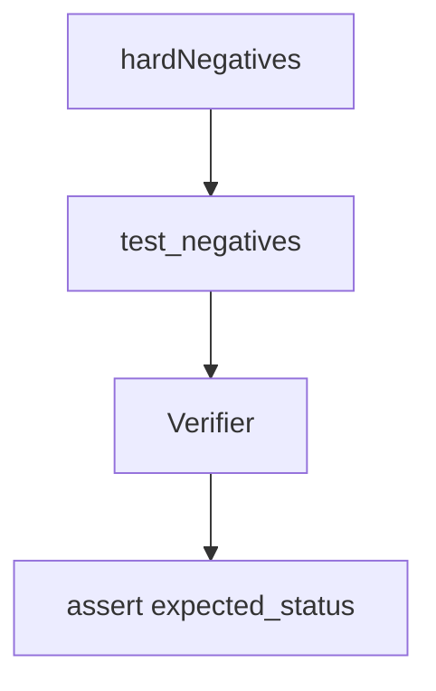

# hard_negatives

## Purpose

**Hard-negative** epistemic contracts: each witness must fail with its **expected typed status**, not merely “not verified.” Wrong rejection reasons are product bugs.

## Role in pipeline

Corpus hard negatives → **THIS** → `Verifier` → assert exact `VerificationStatus`.

## Inputs

- Hard-negative witnesses with `expected_status` from corpus

## Outputs

- Parametrized pytest pass/fail

## Responsibilities

- Prevent silent status drift (e.g. `RESOURCE_DEFICIT` becoming a generic illegal-action failure).
- Keep the typed rejection vocabulary honest.

## Non-responsibilities

- Positive `VERIFIED` checks (`../gold_core/`)
- Adjudication of novel discoveries (`../eval/`)

## Core invariants

- Typed rejection vocabulary is part of the product contract.
- Mere rejection without the expected status fails the suite.

## Main entry points

- `test_negatives.py` (and siblings in this directory)

## Data contracts

Statuses match `semantics.enums.VerificationStatus` / corpus expectations.

## Failure behavior

Wrong status fails even if the witness is rejected.

## Testing

This suite.

## Extension guide

When adding a new rejection mode, add a hard negative that uniquely demands it.

## Bigger-picture relationship

Parent: [`../README.md`](../README.md). Architecture contracts: [`../../docs/ARCHITECTURE.md`](../../docs/ARCHITECTURE.md).
