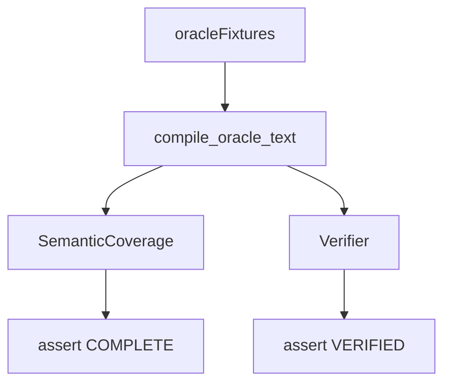

# semantic

## Purpose

Compiler and compile→verify **seam** tests: Oracle fixtures become IR with explicit coverage, and supported compiles still verify. Distinct from gold_core (authored IR) and discovery (blind multi-pair recall).

## Role in pipeline

`semantics.oracle_fixtures` / compiler → **THIS** → coverage asserts + verifier seam.

## Inputs

- Gold Oracle fixtures and unsupported fixtures

## Outputs

- Asserts on `COMPLETE` coverage, fragment coverage, fail-closed unsupported, and verify-after-compile

## Responsibilities

- Lock deterministic compile behavior.
- Prove unsupported text fails closed (`PARTIAL_RELEVANT_TO_PROOF` path → never silent `COMPLETE`).

## Non-responsibilities

- Blind multi-pair discovery (`../discovery/`)
- Authored IR gold_core positives (`../gold_core/`)

## Core invariants

- Gold fixtures compile `COMPLETE` with full fragment coverage.
- Unsupported scepter (and kin) do not silently complete.
- Coverage enum distinctions (`COMPLETE` / `PARTIAL_IRRELEVANT_TO_PROOF` / `PARTIAL_RELEVANT_TO_PROOF`) stay meaningful.

## Main entry points

- `test_compiler.py`
- `test_compile_verify.py`

## Data contracts

`SemanticCoverage` enum and `CompileReport`.

## Failure behavior

Coverage or verify regressions fail CI.

## Testing

This suite.

## Extension guide

New patterns need fixture/compiler asserts before claiming coverage wins.

## Bigger-picture relationship

Parent: [`../README.md`](../README.md). Package: [`../../src/mtg_loop_engine/semantics/README.md`](../../src/mtg_loop_engine/semantics/README.md).
