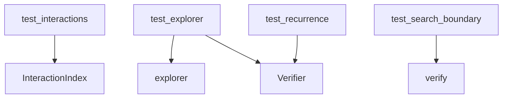

# unit

## Purpose

Fast tests for filters, ingest helpers, recurrence projection, capability joins, explorer primitives, and module-boundary checks without full gold suites.

## Context

## What belongs here

- `test_spellbook_filter.py`, `test_scryfall_ingest.py`, `test_recurrence.py`
- `test_search_boundary.py` (the `verify` package must not import search)
- `test_interactions.py` (inverted-index neighborhoods and `join_reasons`)
- `test_explorer.py` (default board, legal steps, fingerprints, injected verifier)

## What does not belong here

- Full witness verification (see `gold_core/`, `hard_negatives/`)
- Blind rediscovery recall (see `discovery/`)
